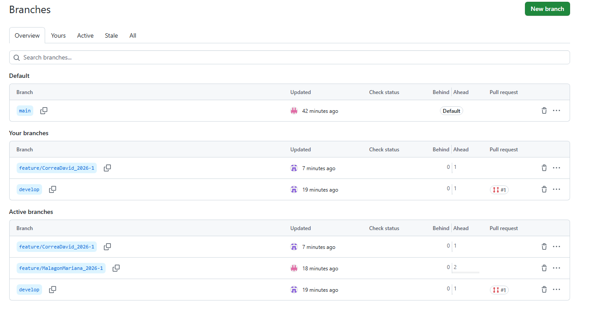
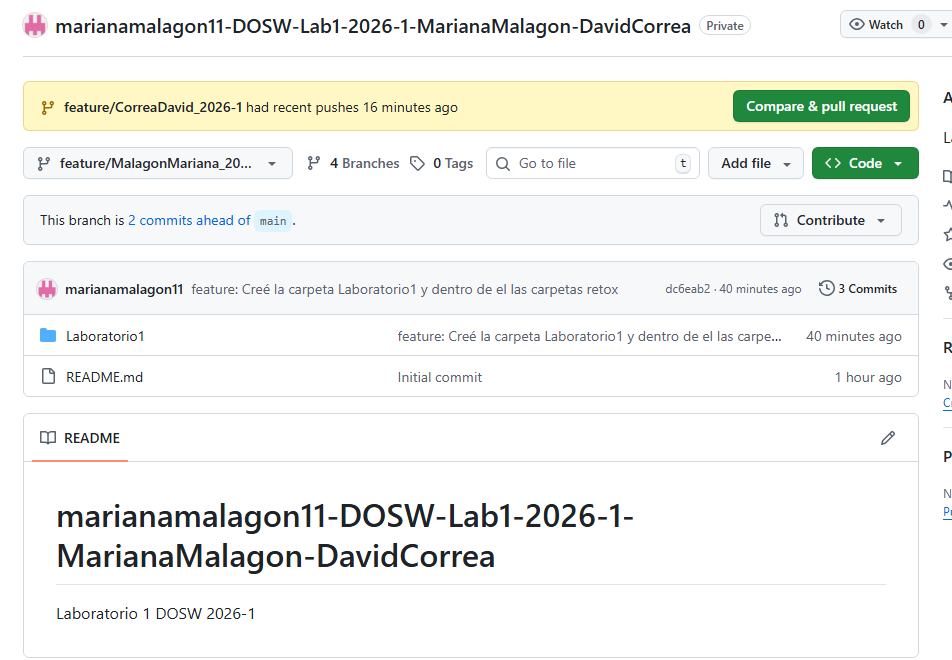

# Maraton Git 2026-1

## Integrantes 
- David Shadday Correa Gonzalez
- Mariana Malagon Tochoy 

---

## Retos completados

### Reto 1: Configuración y creación de rama
**Evidencia:**

**Descripción:**
Breve explicación del proceso realizado para configurar el repositorio y crear una nueva

A la debida creación del repositorio, permitiendo archivo README, se añadieron los integrantes y con GitBash recurrimos a crear cada uno de los integrantes una rama con el formato feature/ApellidoNombre_2026-1.

### Reto 2: Commit colaborativo
**Evidencia:**

**Descripción:**
Cada integrante después de realizar su propia rama, realizó sus cambios en ella misma, y mediante uso de comandos como git push, git pull y git merge. Se relizaron varios pull requests y también cambios efectuados en develop

___

## Preguntas teóricas
- Pregunta 1:

  Respuesta...
=======

