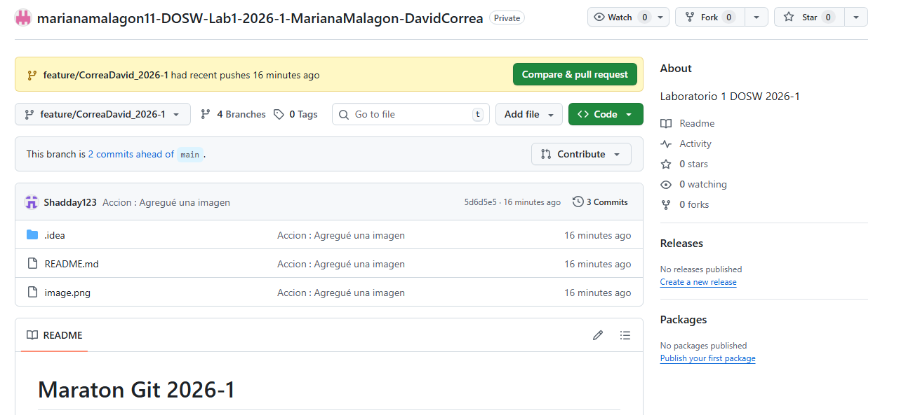

# Maraton Git 2026-1

## Integrantes 
- David Shadday Correa Gonzalez
- Mariana Malagon Tochoy 

---

## Retos completados

### Reto 1: Configuración y creación de rama
**Evidencia:**

**Descripción:**
Breve explicación del proceso realizado para configurar el repositorio y crear una nueva

A la debida creación del repositorio, permitiendo archivo README, se añadieron los integrantes y con GitBash recurrimos a crear cada uno de los integrantes una rama con el formato feature/ApellidoNombre_2026-1.

### Reto 2: Commit colaborativo
**Evidencia:**

**Descripción:**
Cada integrante después de realizar su propia rama, realizó sus cambios en ella misma, y mediante uso de comandos como git push, git pull y git merge. Se relizaron varios pull requests y también cambios efectuados en develop

### Retos de la Hackaton:
### RETO #1: La Bienvenida:
En este reto usamos una expresión lambda para imprimir un saludo de bienvenida con los nombres de nosotros, nuestra edad, correo y semestre.
Usamos lo requerido, stream(), map() y collect().
Este es el resultado:

### Reto 2:
### RETO #2: Carrera en Paralelo  
### Reto 3:
### RETO #3: El eco misterioso:
Para este reto, primero cada estudiante hizo lo requerido, el primero una función que repitiera el mensaje tres veces, y el segundo una función que inviertiera la frase:
Estudiante B:

Ambos le pusimos el mismo nombre a la función para tener conflictos al hacer merge, nos salió este conflicto:

Entonces lo solcionamos mezclando los métodos que cada uno hizo en un método, también juntando la clase que hicimos igual y el resultado fue este:

### Reto 4:
### RETO #4: El tesoro de las llaves duplicadas  
### Reto 5:
### RETO #5: Batalla de Conjuntos  
### Reto 6:
### RETO #6: La máquina de decisiones  
___

## Preguntas teóricas
- Pregunta 1:

  Respuesta...
=======

